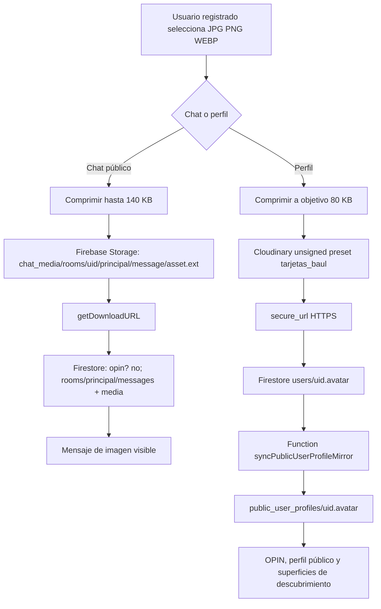

# Auditoría correctiva de fotos, avatares, perfiles y OPIN

**Proyecto:** Chactivo  
**Fecha:** 27 de agosto de 2026  
**Rama local:** `audit/revision-extensa-2026`  
**Estado:** correcciones aplicadas únicamente en local; no se hizo push, merge, deploy de Firebase, deploy de Functions, deploy de Storage Rules ni ejecución SQL.

## 1. Conclusión ejecutiva

Daniel tenía razón en el punto principal: la auditoría anterior no había entregado el rediseño visual drástico que se había anunciado. Los cambios anteriores se concentraron en seguridad, privacidad, SEO, retención y ranking de actividad; por eso las tarjetas, la paleta y la experiencia de OPIN se veían prácticamente iguales. No era correcto presentarlo como un rediseño visual terminado.

En esta auditoría local se corrigieron varios problemas demostrables. Se alineó el contrato de la foto pública del chat con la regla local de Firestore, se endureció la subida de perfil, se eliminaron fallbacks temporales de invitado, se añadió un fallback común para avatares rotos, se cubrieron imágenes directas que todavía podían mostrar el icono de recurso quebrado, se mejoró el manejo de archivos huérfanos cuando Firestore rechaza una foto y se hizo un rediseño real de OPIN.

El límite más importante permanece: **todavía no existe una prueba autenticada contra el Firebase real**. Por tanto, puedo demostrar el código, el build, los tests, el montaje visual local y el flujo anónimo; no puedo afirmar que el bucket, las reglas o la función de espejo ya estén desplegados y operativos en producción.

> Las tablas SQL de Supabase no habilitan por sí solas el envío de archivos. El chat actual utiliza Firebase Storage para los bytes y Firestore para los metadatos del mensaje. El perfil utiliza Cloudinary para el archivo y Firestore para la URL. Una migración futura a Supabase requeriría Storage Buckets, políticas de Storage/RLS, adapters de subida, metadatos y limpieza de archivos; no basta con crear tablas.

## 2. Causas raíz verificadas

| Área | Causa demostrada | Consecuencia | Estado local |
|---|---|---|---|
| Foto pública del chat | `ChatInput` generaba `chat_media/rooms/{uid}/{roomId}/{messageId}/{assetId}.ext`, mientras la validación local de Firestore esperaba el patrón antiguo `chat_media/principal/...`. | Storage podía aceptar el archivo y Firestore rechazar el mensaje de imagen. | Corregido en `firestore.rules`; falta probar y desplegar reglas. |
| Visitante sin sesión | `canSendPhotoNow` exige usuario registrado y sala `principal`. | El botón aparece, pero el visitante recibe “Debes iniciar sesión para subir fotos”. | Comportamiento intencional y comprobado localmente; el control ahora comunica el motivo. |
| Reglas de Storage | `firebase.json` apunta a `storage.rules`, pero esta auditoría no hizo deploy. | El archivo local no demuestra el estado de Firebase Live. | Preparado, no desplegado. |
| Foto de perfil | La foto se sube directamente a Cloudinary y luego se guarda la URL en `users/{uid}.avatar`; no utiliza Supabase ni Firebase Storage. | Crear tablas SQL no arregla esta ruta. | Servicio endurecido localmente. |
| Avatar público | El perfil público se lee de `public_user_profiles`, separado de `users`. La sincronización depende de `syncPublicUserProfileMirror` en Functions. | Si la Function no está desplegada o el espejo quedó antiguo, OPIN puede conservar un avatar viejo o roto. | Trigger verificado en código; despliegue/backfill pendientes. |
| Snapshot de OPIN | Un post guarda `post.avatar`; una URL antigua no vacía podía conservarse aunque ya estuviera rota. | La tarjeta mostraba una imagen quebrada o no reemplazaba el avatar actual. | Hidratación prioriza el perfil público actual y la UI tiene fallback. |
| Imágenes históricas | Varias superficies utilizaban `` directo sin manejo uniforme de error. | Una URL caducada, eliminada o denegada dejaba un recurso roto. | Cubierto en OPIN, chat y componentes de avatar principales. |

## 3. Flujo real de archivos



El perfil no tiene una ruta automática a Firebase Storage en el código auditado. El archivo de perfil se publica en Cloudinary y la URL se guarda en Firestore. Por eso no se debe pedir a Daniel una tabla SQL para “activar” la foto de perfil.

## 4. Cambios aplicados localmente

### 4.1 Chat y foto pública

`ChatInput.jsx` conserva el botón de foto para usuarios registrados en la sala pública, pero ahora valida explícitamente JPG, PNG y WEBP. Se excluyeron HEIC/HEIF y GIF porque el navegador no los puede comprimir de forma uniforme en este flujo. El input, la validación y el mensaje de error quedan alineados.

La subida sigue usando el límite de **140 KB**, máximo de **3 fotos por hora** y máximo de **3 fotos visibles**. Si Storage sube el archivo pero la escritura posterior de Firestore falla, el código intenta eliminar el archivo recién subido. Esto evita acumular archivos huérfanos cuando las reglas de Firestore, la sesión o los metadatos no coinciden.

Los errores de autorización ya no se presentan únicamente como el mensaje técnico del SDK. El usuario recibe una indicación de que debe tener la sesión activa y de que las reglas de Storage/Firestore deben estar desplegadas. Esto no simula éxito.

`firestore.rules` local ahora valida el patrón real de ruta:

```text
chat_media/rooms/{request.auth.uid}/principal/{messageId}/{assetId}.ext
```

También exige metadatos `kind`, `path`, `contentType` y `sizeBytes`, tipo `image/*` y tamaño máximo de 140 KB. La regla local no se considera publicada hasta realizar una prueba con Emulator Suite y un despliegue autorizado.

### 4.2 Perfil y avatar propio

`photoUploadService.js` ya no fabrica IDs temporales ni permite asociar una foto con un UID distinto del usuario autenticado. Exige sesión Firebase, restringe los tipos a JPG, PNG y WEBP, acepta una entrada de hasta 10 MB, comprime a un objetivo de 80 KB, usa timeout de 30 segundos y verifica que Cloudinary devuelva una URL `https://`.

El modal de perfil refleja el límite real de 80 KB, elimina la doble escritura del avatar y limpia el intervalo de progreso incluso cuando Cloudinary falla. El selector de avatar de catálogo entrega la selección al perfil para que se persista una sola vez y se actualice inmediatamente el contexto local.

Cloudinary unsigned no permite eliminar con seguridad un recurso desde el navegador. La eliminación de recursos antiguos sigue requiriendo una operación administrativa; no se afirmó que esté resuelta.

### 4.3 Fallback común de avatar

Se añadió `src/utils/avatar.js` y se conectó con `AvatarImage`. La política permite rutas locales, URLs HTTPS aprobadas, Cloudinary, Firebase Storage y los SVG legítimos de DiceBear que utiliza el catálogo. Rechaza `blob:`, `javascript:`, `http:` y valores vacíos o textualmente inválidos.

Cuando una URL existente falla en red, el componente usa `/avatar_por_defecto.jpeg` en lugar de dejar el icono de imagen rota. El fallback es neutral: no inventa una persona, una presencia ni actividad.

Se cubrieron las siguientes superficies:

| Superficie | Cobertura local |
|---|---|
| Perfil propio | `AvatarImage` base y subida endurecida. |
| Perfil público | `AvatarImage` base. |
| OPIN: autor de tarjeta | URL segura y `onError`. |
| OPIN: oportunidad destacada | URL segura y `onError`. |
| OPIN: preview de respuestas | URL segura y `onError`. |
| OPIN: modal de comentarios | URL segura y `onError`. |
| Chat: avatar del grupo | helper común y fallback Radix. |
| Chat: strip “En privado ahora” | helper común y `onError`. |
| Chat: imagen compartida | mensaje “Imagen no disponible” cuando la URL falla. |
| Chat privado V1/V2 y modales | usan el `AvatarImage` base actualizado. |

### 4.4 Espejo público de perfiles

Se verificó que `functions/index.js` contiene `syncPublicUserProfileMirror` y que el constructor del espejo incluye `avatar` entre los campos públicos permitidos. También existe `backfillPublicUserProfiles` como función callable.

La regla local de Firestore impide que el cliente escriba directamente en `public_user_profiles`. Esto es correcto para evitar que un cliente publique campos arbitrarios. La sincronización depende de que la Function esté desplegada y de que los documentos antiguos hayan sido backfilleados si quedaron desfasados. Ninguna de esas operaciones se ejecutó en esta auditoría.

## 5. Rediseño real de OPIN

El rediseño anterior no fue visual. Esta vez sí se cambiaron elementos visibles y verificables:

| Antes | Ahora en local |
|---|---|
| Cabecera compacta con título OPIN y tonos antiguos. | Cabecera editorial con “Tablón de intención”, descripción de propósito, fondo navy y acentos cyan/fuchsia. |
| Filtros tipo píldora de bajo contraste. | Controles segmentados con mayor contraste, `aria-pressed`, estado activo visible y etiquetas de conteo. |
| Solo una vista de feed priorizado. | `Para ti` conserva el ranking de intenciones abiertas y actividad real; `Más recientes` ordena por `createdAt` descendente. |
| Historial público limitado a 24 elementos devueltos por el servicio. | Feed configurado para hasta 36 posts dentro de la ventana activa real de 60 días; candidatos consultados hasta 100. |
| `Mis intenciones` consultaba hasta 8 documentos. | Consulta hasta 24 intenciones propias. |
| Tarjetas compactas con gradientes antiguos. | Tarjetas con radio de 26 px, superficie navy, profundidad, bordes semánticos por categoría y hover más claro. |
| Colores persistidos con apariencia antigua. | Se conservaron las claves `purple`, `pink`, `cyan`, `orange`, `green` y `blue`, pero se remapearon a una paleta cyan, teal, fuchsia, ámbar e índigo. No se migraron datos. |
| Reacciones asociadas visualmente a emojis. | Los datos siguen usando las claves emoji históricas para compatibilidad, pero los botones visibles usan Hugeicons, texto (“Apoyo”, “Química”, “Favorito”), `title`, `aria-label` y `aria-pressed`. |
| Comentarios antiguos primero. | El servicio y el fallback local ordenan respuestas recientes primero; el modal lo rotula explícitamente. |
| Spinner potencialmente indefinido si una consulta no respondía. | `loadFeed` tiene timeout de 12 segundos y un estado reintentable cuando la promesa falla o tarda demasiado. |
| Estado vacío genérico para todas las vistas. | “Más recientes” explica que muestra hasta 36 intenciones dentro de 60 días; no inventa historial. |

La ampliación a 36 no significa historial infinito. OPIN sigue aplicando una ventana pública de 60 días a posts normales. Los posts estables administrados se comportan según su propio estado. Para historial anterior a esa ventana se necesitaría una vista histórica separada y una política de privacidad/retención definida; no se debe quitar el límite automáticamente.

## 6. Matriz de controles visibles y estado real

| Control visible | Backend o servicio real | Resultado local | Prueba real pendiente | Qué debe desplegarse |
|---|---|---|---|---|
| Subir imagen en chat público | Firebase Storage + Firestore | Visitante: bloqueo claro. Contrato de ruta y metadatos alineado. | Cuenta registrada o Emulator Suite con reglas. | `storage.rules` y `firestore.rules` aprobados. |
| Subir foto de perfil | Cloudinary + `users/{uid}.avatar` | Validación, compresión, timeout y sesión endurecidos. | Subida autenticada real y verificación de URL. | Preset Cloudinary correcto y código frontend. |
| Avatar en perfil propio | Auth context + `users.avatar` | `AvatarImage` con fallback de red. | Confirmar actualización con cuenta real. | Frontend; no SQL. |
| Avatar en perfil público | `public_user_profiles.avatar` | Lectura y fallback. | Confirmar que la Function refleja el avatar actual. | Deploy de `syncPublicUserProfileMirror`; backfill si procede. |
| Avatar en OPIN | Snapshot + espejo público | Se prioriza avatar público disponible y se mantiene snapshot solo como respaldo; fallback ante URL rota. | Post real y espejo real. | Frontend + Function si el espejo está desactualizado. |
| Respuestas OPIN | `opin_comments` | Orden reciente primero en consulta y fallback. | Verificar índice y reglas reales. | Firestore index/rules si el proyecto lo requiere. |
| Reacciones OPIN | Firestore `reactionCounts` y claves históricas | Botones visibles con Hugeicons y estado accesible. | Reacción autenticada real. | Firestore rules/functions según estado actual. |
| “Más recientes” | Orden local sobre los posts recuperados | Funciona en SPA local; leyenda visible. | Confirmar con datos reales. | Frontend. |
| “Ajustes — Próximamente” | No hay módulo operativo conectado | Está rotulado como “Próximamente” y abre modal informativo. | No debe presentarse como funcional hasta implementarlo. | Ninguno ahora. |
| Usuarios cercanos/geolocalización exacta | Feature desactivada/limitada por privacidad | No se promete GPS exacto. | Diseñar ubicación gruesa opcional antes de reactivar. | Backend y política futura. |
| Mensajes de voz | Control comentado, no visible | No se presenta como disponible. | Implementación futura si se autoriza. | No aplica ahora. |

## 7. Pruebas ejecutadas

Se ejecutó `npm test` con los tres archivos de pruebas del proyecto:

```text
3 test files passed
17 tests passed
```

La prueba estática de media/avatar cubre la ruta pública, la coherencia entre ChatInput, Storage y Firestore, metadatos, límites, sesión obligatoria de perfil, fallback de `AvatarImage`, espejo público, orden reciente de OPIN, ampliación a 36 elementos, helper de ChatPage y estado de imagen rota del chat.

También se ejecutó `git diff --check` sin errores y una compilación directa de Vite:

```text
✓ built in 44.77s
```

La aplicación se montó visualmente en localhost con valores Firebase ficticios no sensibles. En `/opin` se observaron la nueva cabecera, el nuevo sistema de filtros, el modo `Más recientes` y la leyenda de orden. En `/chat/principal` se observó el botón `Subir imagen al chat`; al pulsarlo como visitante sin sesión apareció `Debes iniciar sesión para subir fotos.` En `/profile`, el visitante fue redirigido a `/auth`, por lo que no se expuso un editor de perfil sin autenticación.

Estas pruebas son de código, build y UI local. **No son una prueba de upload autenticado ni de reglas desplegadas.**

## 8. Qué debe hacer Daniel cuando autorice la fase de infraestructura

Primero debe verificar en Firebase Console que el proyecto usa el bucket de Storage correcto y que Authentication permite la sesión registrada usada para la prueba. Después debe probar las reglas locales con Emulator Suite. Solo si el upload, la escritura del mensaje, la lectura y la eliminación del mensaje pasan sin rechazos debe desplegar las reglas de Firestore y Storage que apunta `firebase.json`.

A continuación debe comprobar en Functions que `syncPublicUserProfileMirror` está desplegada y revisar logs sin exponer datos personales. Si existen perfiles antiguos cuyo `users.avatar` cambió pero `public_user_profiles.avatar` no, debe evaluar el backfill administrativo con una ventana, permisos y respaldo definidos. No se debe ejecutar un backfill masivo de usuarios sin una autorización específica.

Por último, con una cuenta de prueba segura y sin compartir contraseña, debe ejecutar este recorrido: subir JPG de perfil, comprobar su aparición en perfil propio, abrir un perfil público, crear una nota OPIN, comprobar el avatar de la tarjeta y del modal de comentarios, entrar al chat público y enviar una imagen inferior a 140 KB. Si algo falla, debe registrar únicamente el código técnico sanitizado, la ruta y el momento; nunca tokens, URLs firmadas completas o datos personales.

## 9. Lo que no se hizo

No se inspeccionaron mensajes privados ni perfiles personales reales. No se creó una cuenta. No se mutó ningún documento existente. No se ejecutó SQL. No se activó Supabase como backend principal. No se subieron ni desplegaron reglas. No se desplegaron Functions. No se hizo push, merge ni deploy Vercel/Firebase.

El archivo `storage.rules.to-add.txt` quedó convertido en una nota de advertencia porque su contenido anterior era un fragmento legacy de `profile_photos` y podía inducir a copiar reglas incompletas. La fuente canónica local sigue siendo `storage.rules`, referenciada por `firebase.json`.

## 10. Veredicto

El problema no era una tabla SQL faltante que mágicamente habilitara fotos. Había una combinación de rutas de media desalineadas, dependencias externas no verificadas, espejo público potencialmente desactualizado, snapshots históricos de avatar y fallbacks de imagen insuficientes. El código local ahora trata esos casos de manera más coherente y el rediseño de OPIN sí es visible en la SPA compilada.

El producto todavía no debe anunciar “fotos totalmente operativas” hasta completar una prueba autenticada contra Firebase real o Emulator Suite y desplegar explícitamente las reglas y Functions aprobadas. Esa distinción queda deliberadamente escrita para no volver a confundir una corrección local con una infraestructura publicada.

## Referencias internas

1. [`ChatInput.jsx`](../../src/components/chat/ChatInput.jsx)
2. [`ChatMessages.jsx`](../../src/components/chat/ChatMessages.jsx)
3. [`firestore.rules`](../../firestore.rules)
4. [`storage.rules`](../../storage.rules)
5. [`photoUploadService.js`](../../src/services/photoUploadService.js)
6. [`PhotoUploadModal.jsx`](../../src/components/profile/PhotoUploadModal.jsx)
7. [`OpinFeedPage.jsx`](../../src/pages/OpinFeedPage.jsx)
8. [`OpinCard.jsx`](../../src/components/opin/OpinCard.jsx)
9. [`OpinCommentsModal.jsx`](../../src/components/opin/OpinCommentsModal.jsx)
10. [`opinService.js`](../../src/services/opinService.js)
11. [`functions/index.js`](../../functions/index.js)
12. [`avatar.jsx`](../../src/components/ui/avatar.jsx)
13. [`avatar.js`](../../src/utils/avatar.js)
14. [`avatar-and-media-contract.test.js`](../../tests/avatar-and-media-contract.test.js)
15. [`firebase.json`](../../firebase.json)

## Registro de entrega local

El commit local de esta auditoría es `30459a15cd2d739dacf507e51bf99b5d21eec133` (`fix: repair media avatars and redesign opin locally`). La rama local quedó limpia y está **un commit por delante de `origin/audit/revision-extensa-2026`**. No se hizo push.
